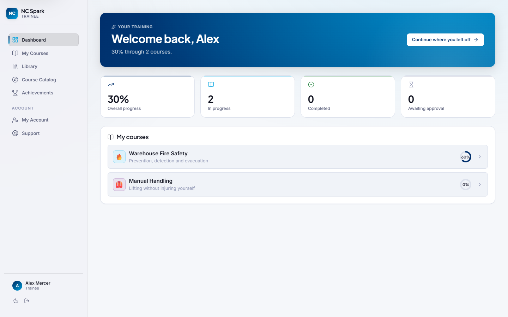
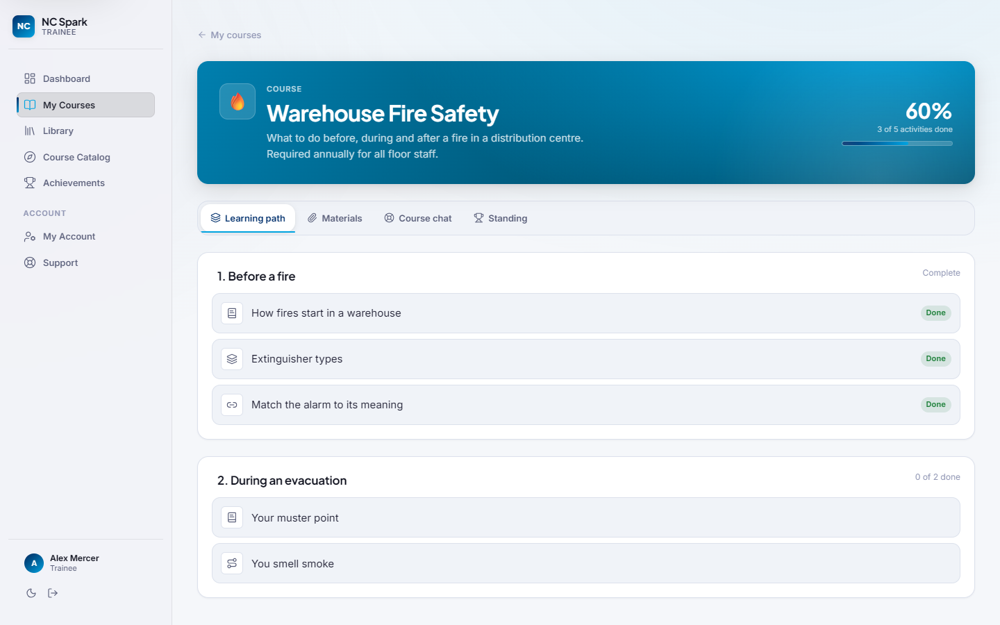
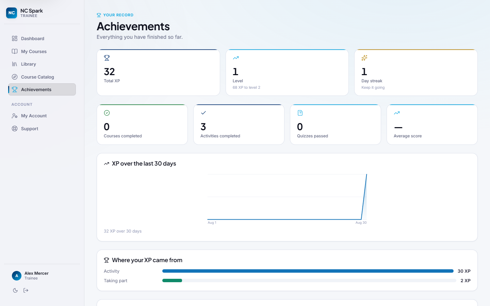
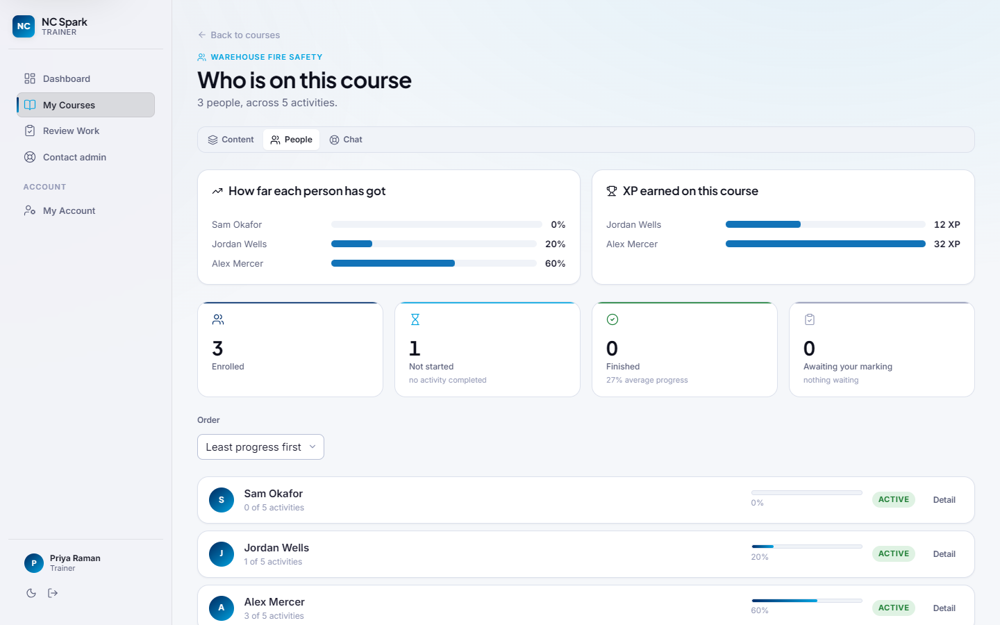
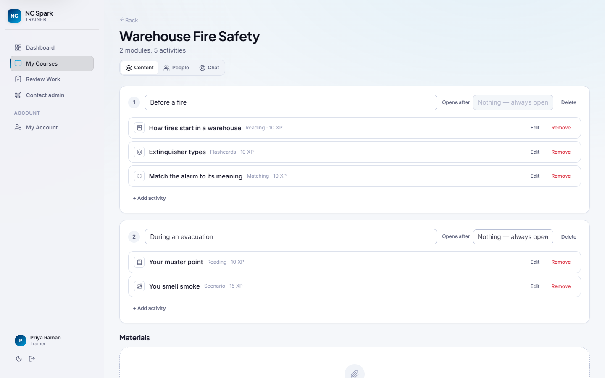
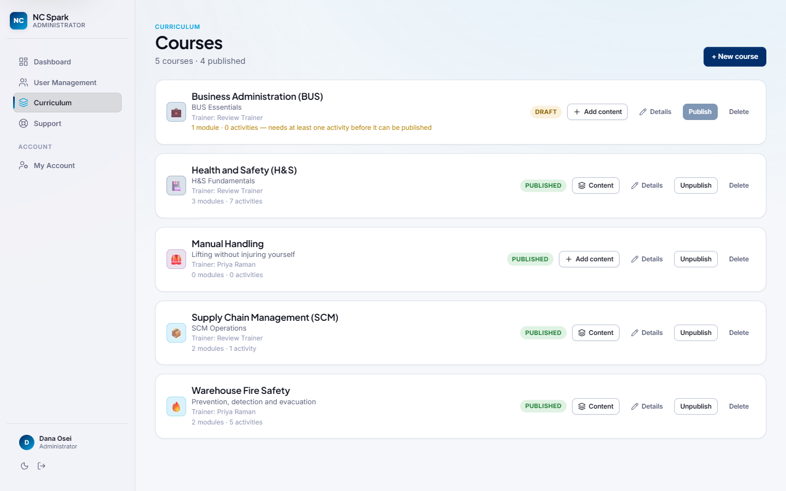
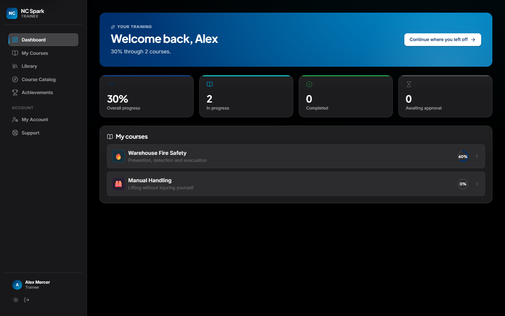
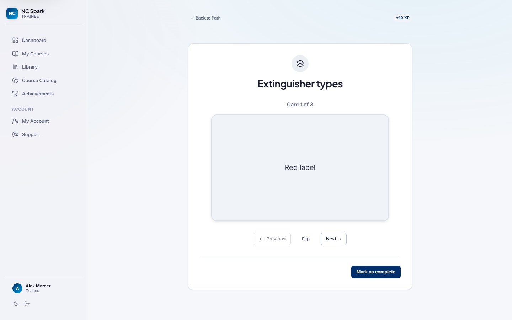
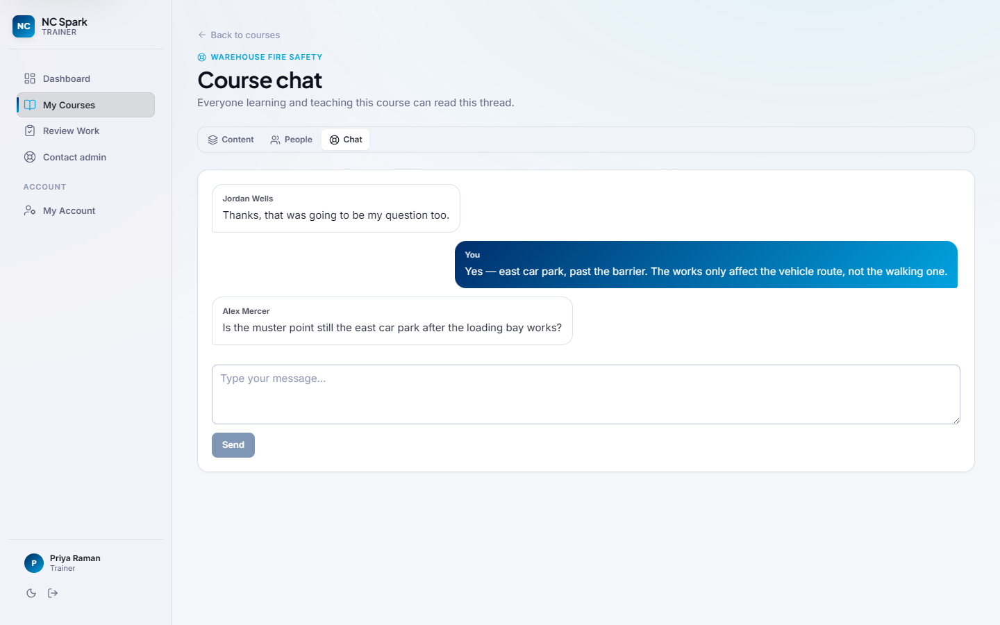

<div align="center">

# NC Spark

**Compliance training that can prove who did what.**

A role-based learning platform for workplace training — the kind where somebody
has to be able to answer *"has this person completed fire safety this year?"*
and be right.

[](https://react.dev)
[](https://vite.dev)
[](https://supabase.com)
[](https://workers.cloudflare.com)




</div>

---

## What it does

Four people need different things from the same courses, so there are four
portals rather than one screen with things hidden on it.

| | |
|---|---|
| **Trainee** | Works through courses, one activity at a time. Modules unlock in order, quizzes are graded server-side, and progress is recorded as it happens. |
| **Trainer** | Owns courses: writes the content, marks written answers, grants second attempts, answers the class in the course chat. |
| **Supervisor** | Oversight without edit rights — how far each cohort has got, which trainees have stalled. |
| **Admin** | Accounts, roles, the domain allowlist, the audit trail, and platform usage. |

**Seven activity types** — reading, video, flashcards, matching, scenario, file
submission and quiz — each with an authoring editor, so a course can be built
entirely in the browser.

**Quizzes are graded on the server.** The answer key lives in a table no browser
role has any grant on; it is only ever touched by an Edge Function. A second
attempt needs a trainer to grant it, and the grant is consumed when it is used.

**XP, streaks, badges and a per-course leaderboard**, all derived from one
append-only ledger — so a badge can never disagree with the record it came from.

---

## Screens

<table>
<tr>
<td width="50%"><br><sub><b>A course, as a trainee sees it.</b> Modules unlock in order; the second stays shut until the first is done.</sub></td>
<td width="50%"><br><sub><b>Achievements.</b> Every figure is derived from the XP ledger, including the days nothing happened.</sub></td>
</tr>
<tr>
<td><br><sub><b>The roster a trainer opens first</b> — sorted least-progress-first, because that is who needs chasing.</sub></td>
<td><br><sub><b>The course builder.</b> The same component the admin console mounts, because the policies authorise both identically.</sub></td>
</tr>
<tr>
<td><br><sub><b>Curriculum.</b> A draft says <em>why</em> it cannot be published yet, rather than failing when you try.</sub></td>
<td><br><sub><b>Dark mode is designed, not inverted</b> — its own steps from the same ramps, checked for contrast.</sub></td>
</tr>
</table>

<details>
<summary>More — an activity, and the course chat</summary>
<br>


</details>

---

## Quick start

```bash
npm install
npm run dev
```

The app needs Supabase credentials in `.env.local` to sign in. Either point it
at a hosted project (copy `.env.local.example`) or run the local stack below.

## Local backend

Requires Docker Desktop and WSL2. If you do not have them:

```powershell
# In an ELEVATED PowerShell (Run as administrator).
# Run it, reboot, then run it again — it detects which stage is needed.
npm run db:setup
```

Once Docker Desktop is running:

```bash
npm run db:start   # start Postgres, Auth, Storage, Realtime (first run pulls ~2 GB)
npm run db:env     # write .env.test.local and .env.local from the running stack
npm run db:reset   # apply all migrations and seed data
npm run test:db    # RLS and Edge Function tests
npm run db:stop
```

`npm run db:env` points both the dev server and the test suite at local.
Delete `.env.test.local` to switch the tests back to the hosted project.

### Working against a hosted project instead

Copy `.env.test.example` to `.env.test` and fill in the six values. Apply
migrations with:

```bash
npx supabase db push --db-url "$(grep '^SUPABASE_DB_URL=' .env.test | cut -d= -f2-)"
```

Use the **session pooler on port 5432**, not transaction mode on 6543 — the
migrations contain DDL that transaction pooling cannot run. Direct database
hosts (`db.<ref>.supabase.co`) are IPv6-only and unreachable on many networks.

Deploy Edge Functions without Docker using `npx supabase functions deploy <name> --use-api`.

### `ALLOWED_ORIGINS`

Edge Functions read a comma-separated allowlist of browser origins:

```bash
npx supabase secrets set ALLOWED_ORIGINS="https://your-app.example.com" --project-ref <ref>
```

It holds the deployed origin plus the Vite dev and preview ports. **Any new
origin has to be added here before the frontend is served from it, or the
browser blocks every function call.** That failure is loud and immediate, which
is the intended trade.

Unset, it does **not** fall back to `*`: `corsFor()` returns no
`Access-Control-Allow-Origin` at all and every cross-origin call fails closed.
An earlier version of this file claimed the opposite.

---

## How it is put together

```
src/
  api/          the only place Supabase is touched, and the only place
                snake_case becomes camelCase
  hooks/        TanStack Query wrappers — one file per api module
  components/
    ui/         the design system: pill, alert, skeleton, empty state,
                stat card, toast. Defined once, nowhere else.
    activities/ the seven activity runtimes a trainee actually uses
    authoring/  the course builder and quiz editor
  pages/        one shell per role, each owning its own routes
  styles/       foundation (tokens) → globals → components → ui → utilities
supabase/
  migrations/   39 of them; the schema is the source of truth
  functions/    14 Edge Functions — every privileged write goes through one
  tests/        RLS and Edge Function tests against a real database
worker/         the Cloudflare Worker access gate in front of the whole site
```

### Architecture notes

- **The live site sits behind an access gate**: a Cloudflare Worker
  (`worker/index.js`) that checks both a valid Supabase session and the
  profile's `status` before serving a single asset, throttles sign-in
  attempts, and sets the site's security headers (CSP, HSTS, frame-ancestors,
  referrer policy). Checking the session alone would not gate anything —
  Supabase Auth is a different origin the Worker never sees.
- **Authentication** is Supabase Auth. Profiles are created by a database
  trigger that ignores any client-supplied role, so a role cannot be
  self-assigned at signup.
- **Privilege escalation** is blocked by three independent layers: column-level
  grants, an RLS `WITH CHECK`, and a `BEFORE UPDATE` trigger.
- **Public signup is closed.** Accounts are created by an administrator; the
  endpoint returns `422 signup_disabled`. Supabase Auth sits outside the access
  gate, so while it was open anyone holding the public anon key could write
  rows into `auth.users`, `profiles` and `trainee_stats`. The domain allowlist
  and the pending queue still govern every account the trigger sees, and email
  confirmation is now required — the trigger activates an allowlisted domain,
  which is only safe if the address has been proved.
- **Privileged writes never touch a table.** Role changes, suspensions, signup
  decisions, publishing and trainer assignment all go through Edge Functions so
  they are validated and audited. `courses.trainer_id` and `courses.status` are
  excluded from the column-level UPDATE grant, which is what makes that
  structural rather than a convention.
- **Every table has RLS on and no grant to `anon`.** A refusal is loud
  (`42501 permission denied`) rather than a silently empty result set, which is
  the failure mode that hides a missing policy for months.

### Gotchas worth knowing

- `citext` cannot be used inside a function pinned to `SET search_path = ''` —
  the type lives in the `extensions` schema. Store lowercase `text` instead.
- An `UPDATE ... WHERE` applies **SELECT** policies to its row scan, so a table
  needs a SELECT policy before self-service updates work. The failure is
  silent: HTTP 200, zero rows, no error.
- A `WITH CHECK` subquery over the same table is itself RLS-filtered and
  returns NULL. Use a `SECURITY DEFINER` helper.
- `postgres_changes` is **best effort**. Realtime polls the WAL and caps how
  many changes it takes per poll; the overflow is dropped, not queued. Measured
  here: 10/10 delivered on a quiet database, 5/10 under churn. Anything that
  must arrive needs a read behind it.

---

## Testing

| Command | Scope |
|---|---|
| `npm test` | Frontend unit and component tests |
| `npm run test:db` | RLS policies and Edge Functions, against a real database |
| `npm run verify:m3` | Live end-to-end check of the learning loop |
| `npm run verify:m4` | Live check of assessment integrity, including a grep of the built bundle |
| `npm run verify:gate` | Live check of the access gate on a deployment |
| `npm run lint` | oxlint |
| `npm run build` | Production build |

Database tests include **red-team suites** asserting that a trainee cannot
promote itself, read another user's email, enumerate the user table, or award
itself XP. Treat a failure there as a security regression, not a flaky test.

### Reading a coverage number here

Coverage has to be counted across **both** suites or it lies. `src/api` is
barely touched by the frontend run and thoroughly exercised by the live one —
`library.js` reads 2% in the first and 98% in the second — because they run
under different vitest configs and neither sees the other's report. Counted as
"either suite reaches it", the app is at 90.8% of statements; the frontend
suite alone reads 86.7%.

```bash
npx vitest run --project app --coverage.enabled --coverage.include='src/**'
npx vitest run --config vitest.db.config.js --coverage.enabled --coverage.include='src/**'
```

Two helpers exist so a new test does not start by rebuilding them:
`src/test/queryHarness.jsx` wraps a hook in a React Query client (per render,
with retries off), and `src/test/supabaseStub.js` stands in for the PostgREST
builder and records the calls — so a test can assert the *filter* as well as
the result, which is what matters wherever RLS decides the rows.

`supabase/tests/admin-console.test.js` is the odd one out: instead of
reimplementing the queries it checks, it imports `src/api/` and runs the code
the browser runs against the live project. That is the only way to catch a
wrong PostgREST embed name — `profiles!teaching_requests_trainer_id_fkey(...)`
is a string, and the frontend unit tests mock `from`, so they pass whatever is
written there while the browser gets a 400.

The live suite runs its files in a **fixed order** (`vitest.db.config.js`).
Vitest's default sequencer sorts slowest-first from cached durations, so no two
runs shared an ordering and a failure could never be reproduced.

---

## Deploying

`npm run deploy` builds the app and ships it with the access gate to Cloudflare
Workers. [docs/DEPLOY.md](docs/DEPLOY.md) covers the whole path: connecting the
repository, build settings, environment variables, and telling the backend
about the new origin afterwards.

Two things are easy to miss, and both fail loudly:

- Worker secrets are **runtime** variables; Vite needs **build** ones. Setting
  only the first gives you a site that builds and cannot sign anybody in.
- The new origin has to be added to `ALLOWED_ORIGINS` or every Edge Function
  call is blocked by the browser.

---

## Documentation

| Where | What |
|---|---|
| [docs/BACKLOG.md](docs/BACKLOG.md) | Everything deferred, and why. Nothing here was missed — it was weighed and postponed. |
| [docs/DEPLOY.md](docs/DEPLOY.md) | Deploying to Cloudflare Workers, step by step |
| `docs/superpowers/specs/` | The backend design this was built from |
| `docs/superpowers/plans/` | Milestone plans, M1 through M4 |

---

## A note on the screenshots

They are captured from a throwaway demo tenant — seeded, photographed and
deleted by one script, so nothing in them is a real account and no real address
appears. Regenerate them with the dev server running:

```bash
npm run dev          # in another terminal
npm run screenshots
```

The admin dashboard and the user directory are deliberately **not** shown:
both list live email addresses, and this repository is public. Keep it that
way if you add a screen.
